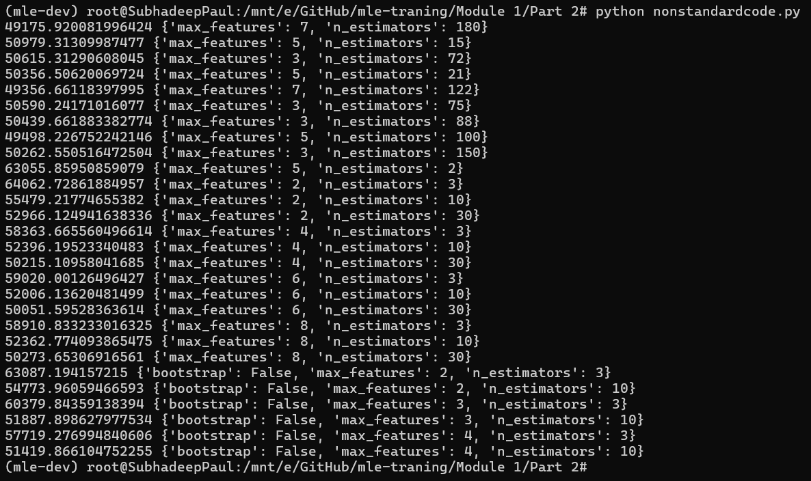

# Assignment 2

## Project Description

### Median housing value prediction

The housing data can be downloaded from https://raw.githubusercontent.com/ageron/handson-ml/master/. The script has codes to download the data. We have modelled the median house value on given housing data. 

The following techniques have been used: 

 - Linear regression
 - Decision Tree
 - Random Forest

#### Steps performed
 - We prepare and clean the data. We check and impute for missing values.
 - Features are generated and the variables are checked for correlation.
 - Multiple sampling techinuqies are evaluated. The data set is split into train and test.
 - All the above said modelling techniques are tried and evaluated. The final metric used to evaluate is mean squared error.

## Creating the environment
To create the **mle-dev** environment, run the following code. 
```
$ conda env create -f env.yml
```

## Activating the environment
To activate the **mle-dev** environment, run the following code. 
```
$ conda activate mle-dev
```

## Running the python script
To run the python script, use the following code
```
$ python nonstandardcode.py
```

## Output Image



