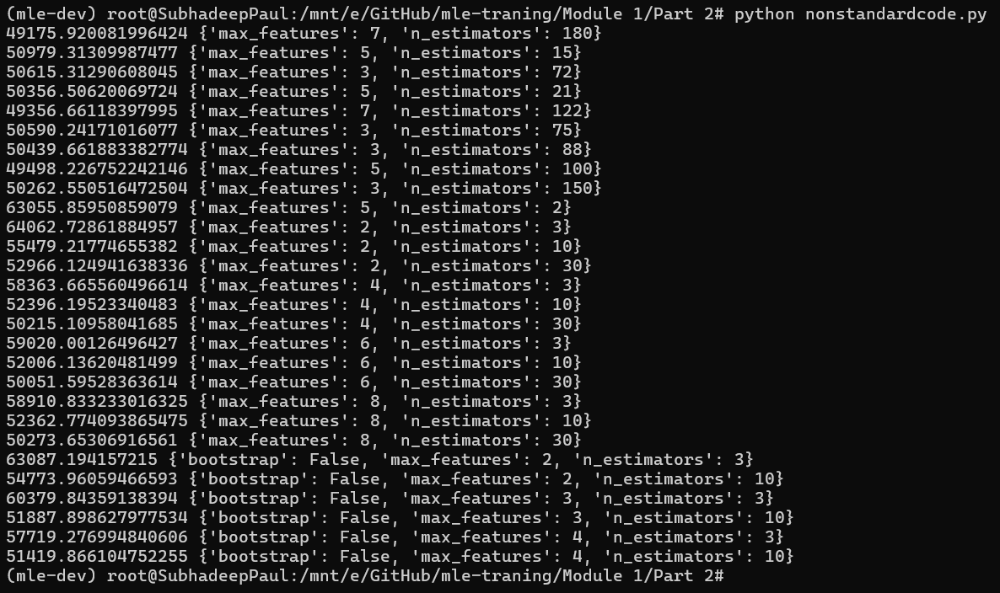

# **MLE Traning TAMLEP**

This repository is made for the submission and documentation of the TAMLEP modules. 

# Module 1 : Developer Environment Setup

This module provides a training of the developer environment and how to set it up for furthur assignments and modules. 

## Assignment 1

1. Go through the tutorial on UNIX shell via https://swcarpentry.github.io/shell-novice/. 

2. Install GIT on your system via 
```
sudo apt install git
```
Read through the reference on GIT in https://git-scm.com/book/en/v2. Practice it on a repo in GitHub. 

3. Install MiniConda on the Ubuntu App via Linux 64 bit Installer, from this [link](https://docs.conda.io/en/latest/miniconda.html). Go through the [Getting Started Guide](https://docs.conda.io/projects/conda/en/latest/user-guide/getting-started.html) and try out the commands.

To run any particular session, use the following command. 
```
scriptreplay my_conda_session -t conda.log 2
```
where the final `2` denotes speed of the session replay.

## Assignment 2

### Project Description

#### Median housing value prediction

The housing data can be downloaded from https://raw.githubusercontent.com/ageron/handson-ml/master/. The script has codes to download the data. We have modelled the median house value on given housing data. 

The following techniques have been used: 

 - Linear regression
 - Decision Tree
 - Random Forest

##### Steps performed
 - We prepare and clean the data. We check and impute for missing values.
 - Features are generated and the variables are checked for correlation.
 - Multiple sampling techinuqies are evaluated. The data set is split into train and test.
 - All the above said modelling techniques are tried and evaluated. The final metric used to evaluate is mean squared error.

### Creating the environment
To create the **mle-dev** environment, run the following code. 
```
conda env create -f env.yml
```

### Activating the environment
To activate the **mle-dev** environment, run the following code. 
```
conda activate mle-dev
```

### Running the python script
To run the python script, use the following code
```
python nonstandardcode.py
```

### Output Image
